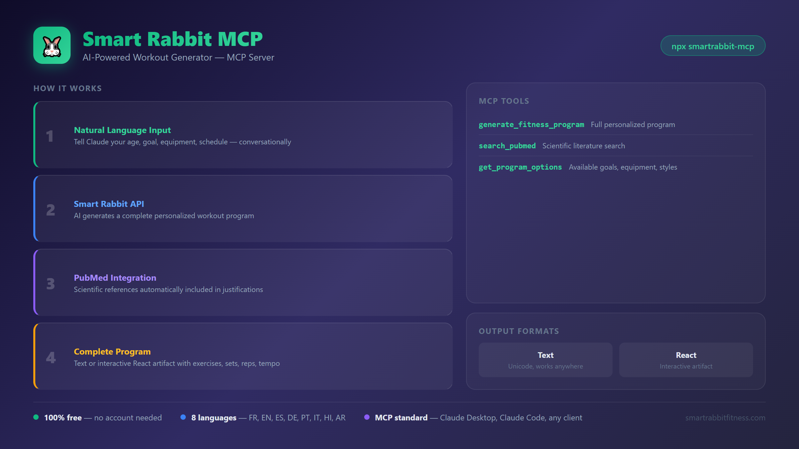

# Smart Rabbit MCP Server

[](https://github.com/contactjccoaching-wq/smartrabbit-mcp)
[](https://opensource.org/licenses/MIT)

MCP (Model Context Protocol) server for [Smart Rabbit Fitness](https://www.smartrabbitfitness.com) — free AI-powered workout program generator.



Works with Claude Desktop, Claude Code, and any MCP-compatible AI assistant.

## Features

- **Personalized programs** — AI generates complete workout plans based on your profile
- **Two output formats** — Plain text (works everywhere) or interactive React artifact (for Claude.ai)
- **PubMed integration** — Scientific references automatically included in justifications
- **Smart questioning** — Asks about preferences, limitations, and condition before generating
- **Multi-language** — Supports FR, EN, ES, DE, PT, IT, HI, AR

## Installation

### Option 1: NPX (Easiest)

No install needed:

```bash
npx smartrabbit-mcp
```

### Option 2: Global Install

```bash
npm install -g smartrabbit-mcp
```

### Option 3: From Source

```bash
git clone https://github.com/contactjccoaching-wq/smartrabbit-mcp.git
cd smartrabbit-mcp
npm install
```

## Configuration for Claude Desktop

Add to your config file:

- **Windows:** `%APPDATA%\Claude\claude_desktop_config.json`
- **macOS:** `~/Library/Application Support/Claude/claude_desktop_config.json`

```json
{
  "mcpServers": {
    "smartrabbit": {
      "command": "npx",
      "args": ["-y", "smartrabbit-mcp"]
    }
  }
}
```

If installed globally:

```json
{
  "mcpServers": {
    "smartrabbit": {
      "command": "smartrabbit-mcp"
    }
  }
}
```

From source:

```json
{
  "mcpServers": {
    "smartrabbit": {
      "command": "node",
      "args": ["/path/to/smartrabbit-mcp/index.js"]
    }
  }
}
```

After adding the config, **restart Claude Desktop**.

## Usage

Just talk to Claude naturally:

```
"Create me a fitness program. I'm 30 years old, male, intermediate level,
I want to build muscle, can train 4 times a week for 60 minutes,
and I have access to a full gym."
```

Claude will:
1. Ask about your preferences, limitations, and condition (if not provided)
2. Call Smart Rabbit API via MCP
3. Search PubMed for scientific references
4. Generate a complete personalized program

### Output Formats

- **Text** (default) — Unicode-formatted plain text, works in any chat interface
- **React** — Interactive React artifact with tabs, dark theme, color-coded by goal (for Claude.ai)

## Available Tools

### generate_fitness_program

Generate a personalized fitness program.

| Parameter | Required | Type | Options |
|-----------|----------|------|---------|
| age | Yes | number | 14-80 |
| sex | Yes | string | `male`, `female` |
| level | Yes | string | `beginner`, `intermediate`, `advanced` |
| sessions | Yes | number | 2-6 sessions/week |
| duration | Yes | number | `30`, `45`, `60`, `75`, `90` minutes |
| equipment | Yes | string | `bodyweight`, `minimal`, `home_gym`, `full_gym` |
| goal | Yes | string | `muscle`, `strength`, `endurance`, `weight_loss`, `wellness`, `definition` |
| format | No | string | `text` (default), `react` |
| condition | No | string | `sedentary`, `light`, `moderate`, `active`, `athletic` |
| style | No | string | `hybrid`, `bodybuilding`, `powerlifting`, `crossfit`, `calisthenics`, `functional` |
| preferences | No | string | Exercise preferences (max 500 chars) |
| limitations | No | string | Injuries/limitations (max 500 chars) |
| include_pubmed | No | boolean | Include PubMed references (default: `true`) |

### search_pubmed

Search PubMed for scientific studies related to fitness and training.

| Parameter | Required | Type | Description |
|-----------|----------|------|-------------|
| query | Yes | string | Search terms (e.g., "hypertrophy training volume") |
| max_results | No | number | 1-10 (default: 5) |

### get_program_options

Returns all available options for goals, equipment, levels, styles, and formats.

## Example Output (Text Format)

```
═══════════════════════════════════════════════════════════
🐰 SMART RABBIT FITNESS PROGRAM
═══════════════════════════════════════════════════════════

📊 PROFILE SUMMARY
─────────────────────
• Age: 30 | Sex: Male | Level: Intermediate
• Goal: Muscle | Sessions: 4/week | Duration: 60 min

═══════════════════════════════════════════════════════════
📅 WEEKLY PROGRAM
═══════════════════════════════════════════════════════════

┌─────────────────────────────────────────────────────────┐
│ DAY 1 - PUSH (Chest/Shoulders/Triceps)                  │
└─────────────────────────────────────────────────────────┘

⭐⭐⭐ HIGH PRIORITY - Compound Movements
─────────────────────────────────────────

1. Bench Press
   ├─ Sets x Reps: 4 x 8-10
   ├─ Tempo: 3-1-2-0
   ├─ Rest: 2 min
   └─ Notes: Progressive overload focus

...

═══════════════════════════════════════════════════════════
  🐰 Generated by Smart Rabbit Fitness — Free AI Workout App
  📱 Create your personalized program in 30 seconds:
                 https://www.smartrabbitfitness.com
  ✨ 100% free · No account needed · AI-powered
═══════════════════════════════════════════════════════════
```

## Links

- **App:** https://www.smartrabbitfitness.com
- **API:** https://smartrabbit-rapidapi.contactjccoaching.workers.dev
- **GitHub:** https://github.com/contactjccoaching-wq/smartrabbit-mcp

## Related Projects

- [**immune**](https://github.com/contactjccoaching-wq/immune) — Adaptive memory system — learns patterns from every scan (+85% code quality)
- [**chimera**](https://github.com/contactjccoaching-wq/chimera) — Bio-inspired 3-stage pipeline (Slime Mold → PRISM → Immune)
- [**spinal-loop**](https://github.com/contactjccoaching-wq/spinal-loop) — Neuromuscular-inspired agent routing (cheap models first)
- [**prism-framework**](https://github.com/contactjccoaching-wq/prism-framework) — Multi-agent synthesis via native LLM stochasticity
- [**daco-framework**](https://github.com/contactjccoaching-wq/daco-framework) — Declarative Agent & MCP Orchestration on Cloudflare Workers

## License

MIT
